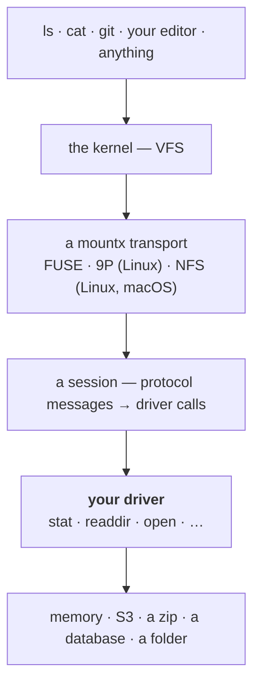

# Introduction

**mountx takes a filesystem you wrote in JavaScript and makes it a real folder on the machine.**

You write an object with the same methods as [`node:fs/promises`](https://nodejs.org/api/fs.html#promises-api) — `stat`, `readdir`, `open`, and whichever of `mkdir`, `rename`, `unlink` make sense for you. mountx serves it to the kernel, and from then on `ls`, `cat`, `git`, VS Code, a build tool or an AI agent can use it without knowing there is any JavaScript involved.

```ts
import { mount } from "mountx/auto";
import { createMemoryDriver } from "mountx/drivers/memory";

await using mounted = await mount(createMemoryDriver(), "/mnt/point");
// /mnt/point is now a real folder
```

::warning
**Alpha.** The API can still change, and mountx has not been through a security or correctness audit. Once mounted, a driver is reachable by every program on the machine.
::

## Why you'd want one

**Because a path is the most portable interface there is.** Anything that reads files can read yours: no plugin, no SDK, no virtual-filesystem shim per tool. An in-memory store, a zip file, an S3 bucket, a database table, a remote API, or a plain folder with your own rules layered on top — give it a path and every program on the machine already knows how to use it.

**Because there is no new API to learn.** `FsDriver` is deliberately a _subset_ of `node:fs/promises`, to the point where `node:fs/promises` itself is a valid driver with no adaptation. So is anything already shaped like it. The errors are `node:fs` errors too — throw a `code: "ENOENT"` and the kernel gets `ENOENT`.

**Because you can build it without mounting anything.** [`createLoopback(driver)`](/guide/drivers/custom#developing-without-mounting) runs your driver in-process with the same path normalization and capability resolution a real mount applies. No kernel, no privileges, works on Windows. Then you swap one line and it is a folder.

## The mental model

Three layers, and only the middle one is yours:



A program calls `open("/mnt/point/notes.txt")`. The kernel turns that into protocol messages, mountx decodes them and calls the methods on your driver, and the values you return are encoded back. Your driver never sees a protocol message, a file descriptor number, or a kernel flag it did not ask for — it sees absolute POSIX paths and returns `fs`-shaped values.

Two consequences worth holding on to:

- **Serving never needs privileges.** All three protocol implementations are pure JavaScript. Only _attaching_ the result to a directory involves the operating system — see [Do I need root?](/guide/quick-start#do-i-need-root)
- **Nothing is faked.** If your driver has no `symlink`, symlinks are not supported, and the mount says `ENOSYS` rather than inventing behaviour. That's the [capability](/guide/drivers/custom#capabilities) rule, and it holds all the way down.

## The three transports

|               | [FUSE](/transports/fuse) | [9P](/transports/9p)            | [NFS](/transports/nfs)                            |
| ------------- | ------------------------ | ------------------------------- | ------------------------------------------------- |
| mounts on     | Linux                    | Linux                           | Linux, macOS                                      |
| root to mount | no, with `fusermount3`   | yes, always                     | Linux: yes · macOS: no                            |
| serves to     | the local kernel         | the local kernel, or a VM guest | anything with an NFSv3 or NFSv4.1 client          |
| what you lose | nothing                  | a rootless path                 | `handles` — a deleted-but-open file goes `ESTALE` |

[`mountx/auto`](/transports) picks one from host facts, so the same code mounts on Linux and macOS. You can also [pin one yourself](/transports#pinning-a-transport).

## What mountx is not

- **Not a filesystem.** It's the plumbing that carries one. The filesystem is the driver you write (or one of the two bundled ones).
- **Not a way to use your own mount from the process serving it.** That deadlocks — see [the threadpool hazard](/guide/troubleshooting#dont-use-your-own-mount-from-the-serving-process).
- **Not able to create special files.** No FIFOs, sockets or device nodes, because `node:fs/promises` cannot create them either.
- **Not stable yet.** Pre-1.0, pre-audit.

## Next steps

- [Quick Start](/guide/quick-start) — install it and have a folder in about a minute.
- [`npx mountx`](/guide/cli) — mount a demo filesystem right now and watch the kernel talk to it.
- [Drivers](/guide/drivers) — the three built-in ones, and the interface for writing your own.
- [Mounting](/guide/mounting) — `mount()`, the mount object, lifecycle and unmount.
- [Virtual machines](/guide/vms) — serve from the host, mount inside a QEMU or Firecracker guest.
- [Tuning](/guide/tuning) — caching, concurrency, and the options worth knowing.
- [Troubleshooting](/guide/troubleshooting) — the things that will bite you, and how to recover.
- [Transports](/transports) — what `auto` is choosing between, and how to pin one.
- [API reference](/reference) — every entry point, option and type.
