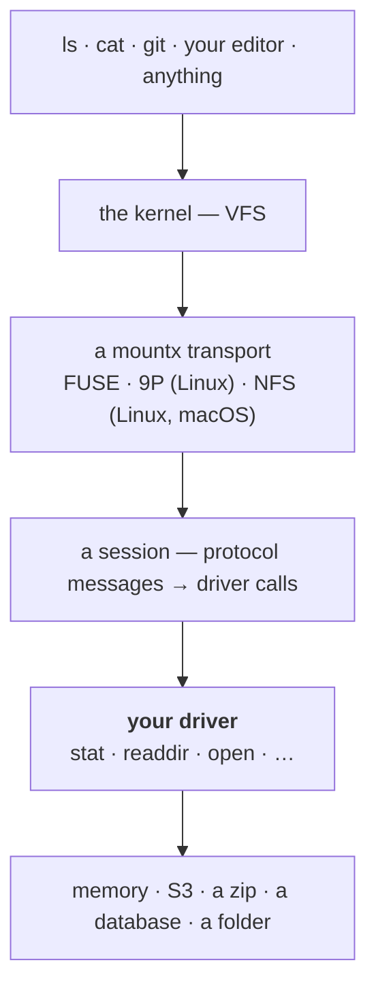

# Introduction

**mountx exposes a JavaScript filesystem as a directory on the host.**

Create an object that uses methods from [`node:fs/promises`](https://nodejs.org/api/fs.html#promises-api). The required methods are `stat`, `readdir`, and `open`. Add methods such as `mkdir`, `rename`, and `unlink` when your filesystem supports them.

mountx serves this object to the kernel. Programs such as `ls`, `cat`, `git`, VS Code, build tools, and AI agents can then use it as a normal directory. These programs do not need to know that JavaScript provides the data.

```ts
import { mount } from "mountx/auto";
import { createMemoryDriver } from "mountx/drivers/memory";

await using mounted = await mount(createMemoryDriver(), "/mnt/point");
// /mnt/point is now a real folder
```

::warning
**Alpha release.** The API can change. mountx has not had a security or correctness audit. After you mount a driver, every program on the host can reach it.
::

## Why you'd want one

**A path works with many programs.** Any program that reads files can read your filesystem.

You do not need a separate plug-in, software development kit (SDK), or virtual-filesystem adapter for each program.

You can expose an in-memory store, archive, S3 bucket, database table, remote API, or directory with custom rules.

**The driver API follows `node:fs`.** `FsDriver` is a subset of `node:fs/promises`. You can use `node:fs/promises` as a driver without an adapter. Other objects with the same shape also work. Drivers throw `node:fs` errors. For example, if a driver throws an error with `code: "ENOENT"`, the kernel receives `ENOENT`.

**You can develop without a mount.** [`createLoopback(driver)`](/guide/drivers/custom#developing-without-mounting) runs the driver in the current process.

It uses the same path normalization and capability resolution as a real mount.

It needs no kernel or privileges and works on Windows.

When the driver is ready, change one call to mount it.

## The mental model

Your driver is the middle layer in this model:



A program calls `open("/mnt/point/notes.txt")`. The kernel converts the call to protocol messages. mountx decodes the messages and calls your driver. It then encodes the driver's result for the kernel.

Your driver does not receive protocol messages, file descriptor numbers, or kernel flags that it did not request. It receives absolute POSIX paths and returns values shaped like `node:fs` values.

This design has two important results:

- **Serving does not need privileges.** All three protocol implementations use pure JavaScript. Only the operating system operation that attaches a mount to a directory can need privileges. See [Do I need root?](/guide/quick-start#do-i-need-root).
- **mountx does not simulate missing features.** If your driver has no `symlink` method, the mount does not support symbolic links. It returns `ENOSYS`. See [capabilities](/guide/drivers/custom#capabilities).

## The three transports

|               | [FUSE](/transports/fuse) | [9P](/transports/9p)            | [NFS](/transports/nfs)                            |
| ------------- | ------------------------ | ------------------------------- | ------------------------------------------------- |
| mounts on     | Linux                    | Linux                           | Linux, macOS                                      |
| root to mount | no, with `fusermount3`   | yes, always                     | Linux: yes · macOS: no                            |
| serves to     | the local kernel         | the local kernel, or a VM guest | anything with an NFSv3 or NFSv4.1 client          |
| what you lose | nothing                  | a rootless path                 | `handles` — a deleted-but-open file goes `ESTALE` |

[`mountx/auto`](/transports) selects a transport from host facts. The same code can mount on Linux and macOS. You can also [select a transport directly](/transports#pinning-a-transport).

## What mountx is not

- **mountx is not a filesystem.** It carries a filesystem. You provide the driver, or use a built-in driver.
- **The server process must not use its own mount.** This can deadlock. See [the threadpool hazard](/guide/troubleshooting#dont-use-your-own-mount-from-the-serving-process).
- **`node:fs` alone cannot create special files.** First-in, first-out (FIFO) files, sockets, and device nodes require [`mountx.mknod`](/reference/capabilities#mountxextensions). The [memory driver](/guide/drivers/built-in#special-files) implements it. A host-directory passthrough cannot implement it.
- **The API is not stable.** It is earlier than version 1.0 and has not had an audit.

## Next steps

- [Quick Start](/guide/quick-start) installs mountx and creates a mount.
- [`npx mountx`](/guide/cli) runs a demonstration filesystem and logs kernel requests.
- [Drivers](/guide/drivers) describes the built-in drivers and the custom driver API.
- [Mounting](/guide/mounting) describes `mount()`, lifecycle, and unmount.
- [Virtual machines](/guide/vms) shows how to serve from a host and mount in a QEMU or Firecracker guest.
- [Tuning](/guide/tuning) explains caching, concurrency, and important options.
- [Troubleshooting](/guide/troubleshooting) explains common failures and recovery steps.
- [Transports](/transports) compares the transport options.
- [API reference](/reference) lists every entry point, option, and type.
