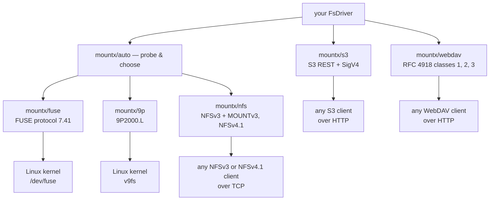

# Transports

**One driver interface, several ways of getting it in front of a client — some of them a kernel, some of them not.**

A transport is everything between the driver you wrote and whatever is going to read it: the protocol codec, the session that turns messages into driver calls, and (for FUSE, 9P and NFSv3) the piece that attaches the result to a directory. `mountx/auto` picks among those three mount transports for you; all three can be [pinned](#pinning-a-transport) directly. The other two, [S3](/transports/s3) and [WebDAV](/transports/webdav), are not mounts at all — they serve the driver to an HTTP client instead, which is exactly why `auto` does not choose either.



## What it is choosing between

|                    | [FUSE](/transports/fuse) | [9P2000.L](/transports/9p)      | [NFS](/transports/nfs)                   |
| ------------------ | ------------------------ | ------------------------------- | ---------------------------------------- |
| `mount…()` runs on | Linux                    | Linux                           | Linux, macOS                             |
| serves to          | the local kernel         | the local kernel, or a VM guest | anything with an NFSv3 or NFSv4.1 client |
| root to mount      | no, with `fusermount3`   | yes, always                     | Linux: yes · macOS: no                   |
| root to serve      | never                    | never                           | never                                    |
| state              | real `open`/`release`    | real `open`/`release` (fids)    | v3 stateless, v4.1 stateful — see below  |
| what you lose      | nothing                  | a rootless path                 | `handles` — see below                    |

**FUSE is preferred wherever it works.** You get real `open`/`release` state, direct control over kernel caching, and every errno passes through untouched.

**9P is next, and Linux root is the only place it competes with NFS.** It is stateful too — a client holds a _fid_ for a path it opened, so `close()`/`fsync()` reach the driver for real and a file deleted while open stays readable — but unlike FUSE it always needs root, since nothing plays `fusermount3`'s role here. It is also the transport a VM guest reaches for against its host, over `trans=tcp`.

**NFS covers what neither of the others can** — macOS most obviously, which has no usable FUSE (macFUSE is a third-party kernel extension speaking its own protocol dialect, not the Linux `fuse.h` that `src/fuse/` is written against) and no v9fs client either, but does ship an NFS client. `mountx/nfs` speaks NFSv3 by default and NFSv4.1 on request (Linux-only); what `auto` picks for you is always the default, NFSv3 — see [NFS](/transports/nfs#two-versions) for the version option.

The trade-off is that NFSv3 is **stateless**. There is no `open`/`release`, so every request carries a handle built from the driver's `(dev, ino)` identity. In practice that costs exactly one behaviour: a file deleted while still open stays readable over FUSE or 9P, and answers `ESTALE` over NFS. NFSv4.1 has real open state and pays the same cost anyway, for a structural reason the NFS page explains.

## How `auto` decides

The preference order is per-platform, and Linux is the only host where more than one transport can work — so it is the only host whose order decides anything.

| host                              | transport | why                                                                  |
| --------------------------------- | --------- | -------------------------------------------------------------------- |
| Linux, `/dev/fuse`, root          | FUSE      | real `open`/`release`, no `ESTALE`, and it can notify                |
| Linux, `/dev/fuse`, non-root      | FUSE      | `fusermount3` + the addon do the mounting                            |
| Linux, root, no FUSE, 9P loadable | 9P        | stateful opens, and it spawns no helper                              |
| Linux, root, no FUSE, no 9P       | NFS       | the fallback: `mount.nfs` + the nfs kernel module                    |
| Linux, non-root, no usable FUSE   | _none_    | 9P and NFS both need root here                                       |
| macOS                             | NFS       | macFUSE is a different protocol, no v9fs client; no root needed here |
| Windows                           | _none_    | no FUSE, no v9fs, no NFS client worth the name                       |

The probe reads facts in order of cheapness — the platform, then the device, then (only when unprivileged) the helper and the addon — and it deliberately loads nothing heavy: no branch pulls in a protocol codec. [`probeTransports()`](/transports/auto#probetransportsplatform) hands you the whole answer, and is cheap enough to call before deciding whether to offer a mount at all.

::note
All three transports arrive through `await import()`, so choosing one never loads either other codec. That is why `mountx/auto` is the recommended entry point rather than a convenience that costs you every stack at once.
::

It also declines to do three things on purpose — no fallback after a failure, no probe when you name a transport, and no wrapping of the mount object it hands back. See [`mountx/auto`](/transports/auto#three-things-auto-deliberately-does-not-do) for why each one is deliberate.

## Pinning a transport

`mountx/fuse`, `mountx/9p` and `mountx/nfs` are the same transports without the probe, for when you know what you want:

```ts
import { mount } from "mountx/fuse"; // Linux only
import { mount9p } from "mountx/9p"; // Linux, root only
import { mountNfs } from "mountx/nfs"; // Linux (root) and macOS (no root)

await using mounted = await mount(createMemoryDriver(), "/mnt/point");
```

Their options sit at the **top level** rather than under `fuse: {…}`/`"9p": {…}`/`nfs: {…}`; everything else is identical, because this is exactly what `mountx/auto` calls.

You can also name one through `auto` and keep the shared-option shape:

```ts
await mount(driver, "/mnt/point", { transport: "nfs", nfs: { exportPath: "/" } });
```

`exportPath` picks the directory an NFS client lands on; it is not a confinement boundary, and everything reachable from the driver's root stays reachable. See [the NFS page](/transports/nfs#exportpath-is-a-starting-point).

## No native code, with one exception

Serving needs none at all — every protocol here is pure JavaScript, which is a design rule of this project. The one exception is a **~7 KB helper** used only to receive the mount connection from `fusermount3`, because unprivileged FUSE mounting needs a file descriptor passed over a unix socket and Node cannot `recvmsg` one.

It is optional, lazy, and never on the root path: mounting as root opens `/dev/fuse` itself and touches no native code, so a host with no prebuilt for its platform loses unprivileged FUSE mounting and nothing else. 9P needs no such helper on any path — `mount9p()`'s local mount is a unix-domain socket the kernel connects to itself, not a descriptor handed across a boundary — which is also why it always needs root: there is nothing here playing `fusermount3`'s role.

It also ships as compressed base64 inside a JavaScript module rather than as a `.node` file — a binary is loaded by path, and a path is the one thing a bundle does not have. The loader extracts it to a private temporary directory, `dlopen`s it, and deletes it again. So it bundles: nothing to configure, nothing to mark external, no sibling file to copy into your output.

## The two transports that are not mounts

[`mountx/s3`](/transports/s3) serves the same `FsDriver` to an S3 client — `rclone`, the AWS CLI, an SDK, a presigned URL — and [`mountx/webdav`](/transports/webdav) serves it to a WebDAV client, over plain HTTP in both cases. Neither produces a mountpoint, so both sit outside everything above: `probeTransports()` never mentions them, `mountx/auto` never picks them, and pinning is the only way to reach either. Reach for one when what is in front of the driver is an HTTP client rather than `ls` and `cat`.

Between the two: **S3** is for object-storage clients and has no directories, no rename and no partial write, but it does have multipart uploads and presigned URLs. **WebDAV** is a filesystem protocol — collections, `MOVE` on top of the driver's `rename`, byte ranges — and it is the one a kernel can mount without root or native code (`davfs2` on Linux, `mount_webdav` on macOS, the Windows redirector), which makes it the portable escape hatch when none of the three mount transports fit.

## Next

- [`mountx/auto`](/transports/auto) — the chooser itself: every option and type.
- [FUSE](/transports/fuse) — the preferred mount transport, in detail.
- [9P2000.L](/transports/9p) — stateful and root-only, for a Linux host or a VM guest.
- [NFS](/transports/nfs) — both versions, including serving without mounting at all.
- [S3](/transports/s3) — the gateway transport, and why it stays out of `auto`.
- [WebDAV](/transports/webdav) — RFC 4918 classes 1, 2 and 3, and the unprivileged way to get a mountpoint anyway.
