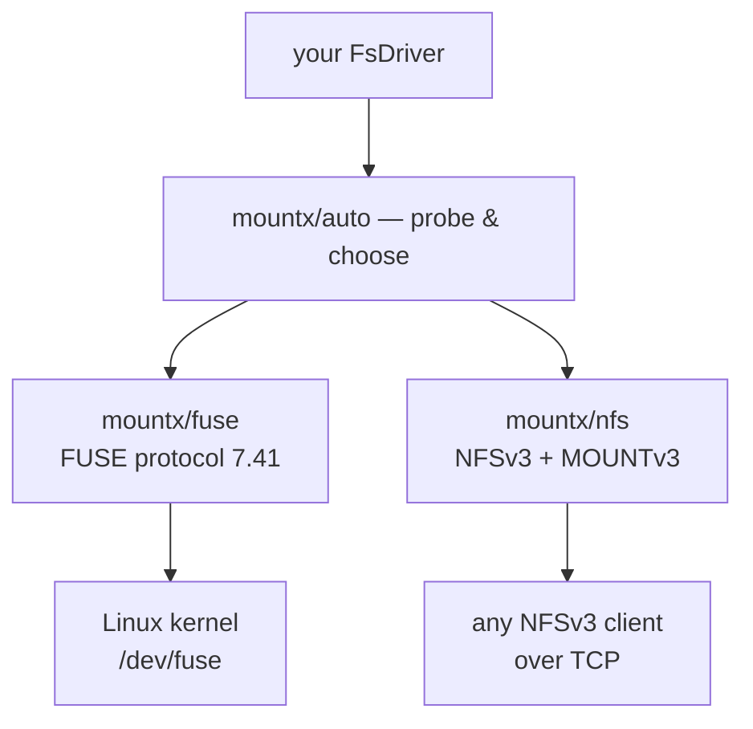

# Transports

**One driver interface, two ways of getting it in front of a kernel.**

A transport is everything between the driver you wrote and the operating system: the protocol codec, the session that turns messages into driver calls, and the piece that attaches the result to a directory. `mountx/auto` picks one for you; both can be [pinned](#pinning-a-transport) directly.



## What it is choosing between

|                    | [FUSE](/transports/fuse) | [NFSv3](/transports/nfs)      |
| ------------------ | ------------------------ | ----------------------------- |
| `mount…()` runs on | Linux                    | Linux, macOS                  |
| serves to          | the local kernel         | anything with an NFSv3 client |
| root to mount      | no, with `fusermount3`   | Linux: yes · macOS: no        |
| root to serve      | never                    | never                         |
| what you lose      | nothing                  | `handles` — see below         |

**FUSE is preferred wherever it works.** You get real `open`/`release` state, direct control over kernel caching, and every errno passes through untouched.

**NFSv3 covers everything else** — macOS most obviously, which has no usable FUSE (macFUSE is a third-party kernel extension speaking its own protocol dialect, not the Linux `fuse.h` that `src/fuse/` is written against) but does ship an NFSv3 client.

The trade-off is that NFSv3 is **stateless**. There is no `open`/`release`, so every request carries a handle built from the driver's `(dev, ino)` identity. In practice that costs exactly one behaviour: a file deleted while still open stays readable over FUSE, and answers `ESTALE` over NFS.

## How `auto` decides

The preference order is per-platform, and Linux is the only host where both can work — so it is the only host whose order decides anything.

| host                         | transport | why                                                  |
| ---------------------------- | --------- | ---------------------------------------------------- |
| Linux, `/dev/fuse`, root     | FUSE      | real `open`/`release`, no `ESTALE`                   |
| Linux, `/dev/fuse`, non-root | FUSE      | `fusermount3` + the addon do the mounting            |
| Linux, no usable FUSE, root  | NFS       | needs no `/dev/fuse` and no helper                   |
| macOS                        | NFS       | macFUSE is a different protocol; no root needed here |
| Windows                      | _none_    | no FUSE, no NFS client worth the name                |

```ts
import { probeTransports } from "mountx/auto";

const probe = await probeTransports();
probe.platform; // the platform it answered for
probe.chosen; // "fuse" | "nfs" | undefined
probe.preference; // e.g. ["fuse", "nfs"] on Linux
probe.fuse; // { usable, reason }
probe.nfs; // { usable, reason }
probe.reason; // when nothing works, naming both
```

The probe reads facts in order of cheapness — the platform, then the device, then (only when unprivileged) the helper and the addon — and it deliberately loads nothing heavy: neither branch pulls in a protocol codec.

::note
Both transports arrive through `await import()`, so choosing one never loads the other's codec. That is why `mountx/auto` is the recommended entry point rather than a convenience that costs you both stacks.
::

## Three things `auto` deliberately does not do

- **No fallback after a failure.** The probe decides once. If the chosen transport then fails to mount, that error is what you get — silently mounting the _other_ one would hand back a filesystem with different semantics than the error you never saw.
- **No probing when you name a transport.** `{ transport: "fuse" }` calls the FUSE transport directly, whose own errors are more specific than anything the chooser could say.
- **No wrapping.** The result is the transport's own mount object with a `transport` property defined on it. Narrowing on that tag reaches `session`, `fd` and the `notifyInval*` pair for FUSE, or `server` and `port` for NFS — and `await using` works either way.

## Pinning a transport

`mountx/fuse` and `mountx/nfs` are the same transports without the probe, for when you know what you want:

```ts
import { mount } from "mountx/fuse"; // Linux only
import { mountNfs } from "mountx/nfs"; // Linux (root) and macOS (no root)

await using mounted = await mount(createMemoryDriver(), "/mnt/point");
```

Their options sit at the **top level** rather than under `fuse: {…}`/`nfs: {…}`; everything else is identical, because this is exactly what `mountx/auto` calls.

You can also name one through `auto` and keep the shared-option shape:

```ts
await mount(driver, "/mnt/point", { transport: "nfs", nfs: { exportPath: "/" } });
```

## No native code, with one exception

Serving needs none at all — both protocols are pure JavaScript, which is a design rule of this project. The one exception is a **~7 KB helper** used only to receive the mount connection from `fusermount3`, because unprivileged FUSE mounting needs a file descriptor passed over a unix socket and Node cannot `recvmsg` one.

It is optional, lazy, and never on the root path: mounting as root opens `/dev/fuse` itself and touches no native code, so a host with no prebuilt for its platform loses unprivileged FUSE mounting and nothing else.

It also ships as compressed base64 inside a JavaScript module rather than as a `.node` file — a binary is loaded by path, and a path is the one thing a bundle does not have. The loader extracts it to a private temporary directory, `dlopen`s it, and deletes it again. So it bundles: nothing to configure, nothing to mark external, no sibling file to copy into your output.

## Next

- [FUSE](/transports/fuse) — the preferred transport, in detail.
- [NFSv3](/transports/nfs) — including serving without mounting at all.
- [`mountx/auto` reference](/reference/auto) — every option and type.
