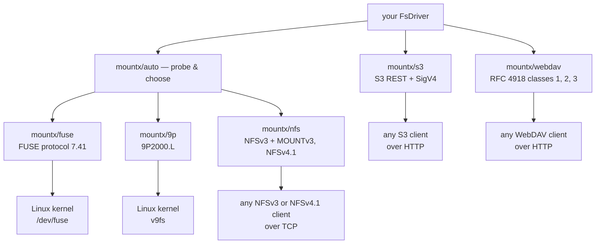

# Transports

**All transports use one driver interface. Some transports connect to a kernel. Other transports connect to an HTTP client.**

A transport contains the layers between a driver and its client.

These layers include the protocol codec and the session that converts messages to driver calls.

FUSE, 9P, and NFS also include code that attaches the result to a directory. `mountx/auto` selects one of these three mount transports.

You can also [select a transport directly](#pinning-a-transport). [S3](/transports/s3) and [WebDAV](/transports/webdav) do not create mounts. They serve the driver to an HTTP client, so `auto` does not select them.



## What it is choosing between

|                    | [FUSE](/transports/fuse) | [9P2000.L](/transports/9p)      | [NFS](/transports/nfs)                   |
| ------------------ | ------------------------ | ------------------------------- | ---------------------------------------- |
| `mount…()` runs on | Linux                    | Linux                           | Linux, macOS                             |
| serves to          | the local kernel         | the local kernel, or a VM guest | anything with an NFSv3 or NFSv4.1 client |
| root to mount      | no, with `fusermount3`   | yes, always                     | Linux: yes · macOS: no                   |
| root to serve      | never                    | never                           | never                                    |
| state              | real `open`/`release`    | real `open`/`release` (fids)    | v3 stateless, v4.1 stateful — see below  |
| what you lose      | nothing                  | a rootless path                 | `handles` — see below                    |

**mountx prefers FUSE when it is available.** FUSE provides real `open` and `release` state. It gives you direct control of kernel caching and passes each errno through without a change.

**9P is the second choice.** It competes with NFS only on Linux when the process has root. A client holds a _fid_ for an open path. Therefore, `close()` and `fsync()` reach the driver, and a file stays readable after deletion. Unlike FUSE, 9P always needs root because it has no helper such as `fusermount3`.

A virtual machine (VM) guest can also use 9P to reach its host over `trans=tcp`.

**NFS supports hosts that cannot use the other transports.** macOS is the clearest example. It has no compatible FUSE implementation and no v9fs client, but it includes an NFS client. macFUSE is a third-party kernel extension with its own protocol. It does not use the Linux `fuse.h` protocol that `src/fuse/` implements.

`mountx/nfs` uses NFSv3 by default. You can request NFSv4.1 on Linux. `auto` always uses the default NFSv3 version. See [NFS](/transports/nfs#two-versions) for the version option.

The trade-off is that NFSv3 is **stateless**.

There is no `open`/`release`, so every request carries a handle built from the driver's `(dev, ino)` identity.

In practice that costs exactly one behaviour: a file deleted while still open stays readable over FUSE or 9P, and answers `ESTALE` over NFS.

NFSv4.1 has real open state and pays the same cost anyway, for a structural reason the NFS page explains.

## How `auto` decides

The preference order depends on the platform. Linux is the only host where more than one mount transport can work. Therefore, the order matters only on Linux.

| host                              | transport | why                                                                  |
| --------------------------------- | --------- | -------------------------------------------------------------------- |
| Linux, `/dev/fuse`, root          | FUSE      | real `open`/`release`, no `ESTALE`, and it can notify                |
| Linux, `/dev/fuse`, non-root      | FUSE      | `fusermount3` + the addon do the mounting                            |
| Linux, root, no FUSE, 9P loadable | 9P        | stateful opens, and it spawns no helper                              |
| Linux, root, no FUSE, no 9P       | NFS       | the fallback: `mount.nfs` + the nfs kernel module                    |
| Linux, non-root, no usable FUSE   | _none_    | 9P and NFS both need root here                                       |
| macOS                             | NFS       | macFUSE is a different protocol, no v9fs client; no root needed here |
| Windows                           | _none_    | no FUSE, no v9fs, no NFS client worth the name                       |

The probe checks the least expensive facts first. It checks the platform, then the device. For an unprivileged process, it then checks the helper and addon. The probe does not load any protocol codec.

[`probeTransports()`](/transports/auto#probetransportsplatform) returns the complete result. You can call it before you offer a mount.

::note
All three transports load through `await import()`. Choosing one never loads either of the other two codecs. Therefore, `mountx/auto` does not add the cost of every protocol stack.
::

It also has three deliberate limits. It does not fall back after a failure. It does not probe when you name a transport. It does not wrap the returned mount object. See [`mountx/auto`](/transports/auto#three-things-auto-deliberately-does-not-do) for the reasons.

## Pinning a transport

Use `mountx/fuse`, `mountx/9p`, or `mountx/nfs` to select a transport without a probe:

```ts
import { mount } from "mountx/fuse"; // Linux only
import { mount9p } from "mountx/9p"; // Linux, root only
import { mountNfs } from "mountx/nfs"; // Linux (root) and macOS (no root)

await using mounted = await mount(createMemoryDriver(), "/mnt/point");
```

Their options are at the **top level**. They are not under `fuse: {…}`, `"9p": {…}`, or `nfs: {…}`. All other behavior is identical because `mountx/auto` calls these transports directly.

You can also name one through `auto` and keep the shared-option shape:

```ts
await mount(driver, "/mnt/point", { transport: "nfs", nfs: { exportPath: "/" } });
```

`exportPath` picks the directory an NFS client lands on; it is not a confinement boundary, and everything reachable from the driver's root stays reachable. See [the NFS page](/transports/nfs#exportpath-is-a-starting-point).

## No native code, with one exception

Serving uses only JavaScript. This is a project design rule. One **~7 KB helper** is the only exception. Unprivileged FUSE mounting must receive a file descriptor from `fusermount3` over a Unix socket. Node cannot call `recvmsg` to receive it.

The helper is optional and loads only when needed. The root path opens `/dev/fuse` directly and does not load native code. A host without a compatible prebuilt loses only unprivileged FUSE mounting.

9P does not need this helper. For a local mount, the kernel connects to the Unix-domain socket from `mount9p()`. It does not receive a descriptor across a process boundary. However, 9P always needs root because it has no helper such as `fusermount3`.

The helper ships as compressed base64 in a JavaScript module instead of a separate `.node` file. A native binary must load from a path, but a bundle might not preserve that path.

The loader extracts the binary to a private temporary directory. It calls `dlopen` and then deletes the file. Bundlers do not need configuration, an external declaration, or a sibling output file.

## The two transports that are not mounts

[`mountx/s3`](/transports/s3) serves the same `FsDriver` to an S3 client. Clients include `rclone`, the AWS CLI, an SDK, and a presigned URL. [`mountx/webdav`](/transports/webdav) serves the driver to a WebDAV client. Both use plain HTTP.

Neither transport creates a mount point. `probeTransports()` does not include them, and `mountx/auto` does not select them. Import one directly when an HTTP client must access the driver.

**S3** is for object-storage clients. It has no directories, rename, or partial write. It supports multipart uploads and presigned URLs.

**WebDAV** is a filesystem protocol. It supports collections, byte ranges, and `MOVE` through the driver's `rename`. A WebDAV client can create a mount without root or native code. Examples include `davfs2` on Linux, `mount_webdav` on macOS, and the Windows redirector.

## Next

- [`mountx/auto`](/transports/auto): the chooser itself: every option and type.
- [FUSE](/transports/fuse): the preferred mount transport, in detail.
- [9P2000.L](/transports/9p): stateful and root-only, for a Linux host or a VM guest.
- [NFS](/transports/nfs): both versions, including serving without mounting at all.
- [S3](/transports/s3): the gateway transport, and why it stays out of `auto`.
- [WebDAV](/transports/webdav): RFC 4918 classes 1, 2 and 3, and an unprivileged way to create a mount point.
